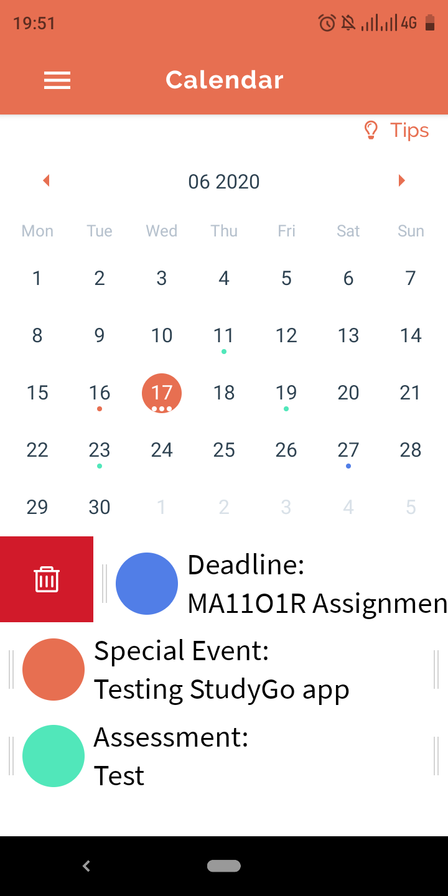
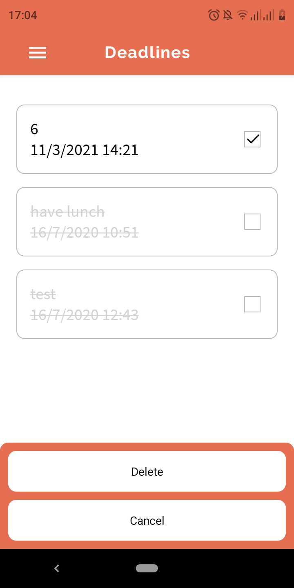

StudyGo is a mobile phone application for students (especially NUS’s undergraduates) to efficiently keep track of their academic schedule and performance. StudyGo also allows users to share and compare their progress with others

This document aims to showcase all of StudyGo's functionalities.
Open this document in a modern internet browser (Mozilla Firefox, Google Chrome, or Microsoft Edge)

* Table of Contents
{:toc}

# 1. Quick start:
If you are using an Android device, click on [this link](https://github.com/aidoxe-123/StudyGo/releases/tag/v1.0.4) to download the StudyGo .apk file. After that, go to the folder section of your phone to install the application. Once install, a StudyGo icon will appear on your device. Tap on the icon and get started!

# 2. Features:

On first opening, your landing page will look like this

## 2.1 Login:

Having an account allows your data to be stored online and shared my multiple devices.
On the landing page, enter your email and password, then click `Login`

Once you have logged in, you will see a screen like this

If you have not had an account yet, click `Register` and move to section [2.2 Create a new account](#22-create-a-new-account)

:information_source: Notes about logging in
* Your login information will be remembered so that you don't have to login again every time you open StudyGo

## 2.2 Create a new account:

You are a new user and haven't got any StudyGo accounts yet? No worries, simply click on the `Sign up here!` text to move to the create account section

On this section, type in the informations needed including username, email, password, repeated password; then click on the `Sign up` button to finish creating a new account.

Once you have successfully registered, the application will automatically direct you back to the login page. Use the new account that you have just created to [login](#21-login)

## 2.3 Navigate between sections:

StudyGo consists of 4 main sections, including Timetable, Calendar, Progress Tracker and Deadlines

To navigate between different sections, click on the menu button on the top left corner, a drawer will slide out from the left of your screen. In the drawer, your username is visible under the profile picture, you can choose to move between sections from here, by clicking on their name. You can also press `Log out` to log out

## 2.4 Plan your weekly tasks with timetable:

Timetable is a feature that helps you keep track of repetitive weekly tasks such as school lectures or labs. On the timetable page, you will have a list of week days on the left column, and a list of 24h-based time slots on the top row. The blue boxes are the weekly tasks. You can swipe left and right to see the whole timetable

### 2.4.1 Add new timeslot:

You can easily add a class into your timetable to keep track of your weekly schedule. First, press the orange cirlce button on the bottom right corner of your screen. You will see this pop-up

Type in your class name (compulsory) and the description of your class (optional). You can also set the date and time of your class by tapping on the date (i.e MOND..) and the time text. Press the tick button to finish adding class

:information_source: Notes about adding class
* If you don't set the date and time of your class, the default one will be used instead, which is 8 am - 9 am on Monday
* The end time must be later than the start time

### 2.4.2 Delete/Edit an existing timeslot:

You can recover from your mistake during your timetable planing by either deleting or editing your existing timeslots

First, choose the class you want to delete/edit by tapping on it. A pop-up will appear on your screen. You can tap on the pen button to toggle between view mode and edit mode

View Mode

Edit Mode

To delete a class, simply click on the red trash can button in edit mode

To edit a class, change the class information in edit mode, then click the tick button

:information_source: Notes about editing existing class
If you exit the edit mode in any ways (including tapping the x button or the pen button), the edited information will not be saved

## 2.5 Record events with calendar 
Different from the timetable, the calendar feature focuses more on keeping track of unrepeated events (such as assignments or workshops)

There are 3 types of events: Deadline, Assessment and Special Event. Each event will be marked with a different color

### 2.5.1 View an event

To view events that happen in a particular date, press on that date. The events that happen in that day will be listed below the calendar

### 2.5.2 Add an event
Long press on any date to add a new event to the calendar. A pop up will appear on the screen. Type in the event name and select type of the event. The press tick to successfully add an event to the calendar

### 2.5.3 Delete an event
To delete an event that is [currently visible](#251-view-an-event), swipe that event item to the right and press the trash can button to delete it

### 2.5.4 Edit an event
To edit an event that is [currently visible](#251-view-an-event), swipe that event item to the left, press on the pen button, update the event details and press tick to confirm

## 2.6 Keep track of your school work with progress tracker

The progress tracker allows you to create folders of different NUS modules and keep track of the work load in each module

### 2.6.1 Add new module

By pressing the button at the bottom right of the screen, you will be redirected to a screen to add your module. By typing in the module code or title, you will find a list of suggested modules. Press into the module you wanted and you are done

:information_source: Notes about adding module
* You can only have one folder per module

### 2.6.2 Delete finished module

If you wish to delete a module, swipe it to the left and press the trash can button to delete it

### 2.6.3 View workload inside a module

To view the workload inside a module, simply click on it

The tasks of a module can be divided into 2 types unfished tasks and finished tasks. Choose the type at the bottom of the screen to move between these types.

### 2.6.4 Unfinished task

The unfinished tasks could be divided into two types: personal ones that you only make for yourselves, like the task of “catching up with the two webcasts that I have lagged behind”, and public ones that could be related by many others, like “finish assignment II”. For the public ones, you will be able to see how many of others have finished the same task

#### 2.6.4.1 Add an unfinished task
To add an unfished task, press the circle button at the bottom right of the screen. Fill in the title of the task, the progress (i.e what percentage of the task that you have done). By default, your task is set private, but you can also link your task to others by pressing `change`

:information_source: Notes about linking tasks
* There are two ways you can make your task public. One is finding and linking your task to an existing public one. Choose the option saying `Search for an already created one`, search for the public task by its name, and press `Done`. By doing so, you could know how many others have finished the linked task, and whether or not you finish the task will also be shown to others whose tasks are linked to this task

* If you cannot find the desirable task, you could create one so that others could link to the task you want to track with. Instead of choosing the `Search for an already created one` option, you should choose the `Make this task available to others for them to search` option and press `Done`

#### 2.6.4.2 View/Delete/Edit an existing task; Mark it as done
Pressing a task on your screen will lead you to a new screen so you can update the title and the progress of your task. If the task is a public one, only if you are the host then changing the name will also change what others can see when they look up for the name. Otherwise, your title of the task will only be changed locally

If you wish to change your linking status, such as decide to make your personal task public, press `Change` and you will be redirected to the similar screen to when you choose the linking status for your task

If you complete the task and want to track your mark later, press `Marked as finished`. Doing so, a task with the same title as the selected task will be created in the `Finished tasks` tab

### 2.6.5 Finished task
This is where you can track all of your marks obtained. By pressing the `finished task` button at the bottom right of the screen, you will be led to a new screen to keep track of your finished tasks

A finished task can have one of the following properties: graded, ungraded (i.e cannot be graded) or not graded yet

#### 2.6.5.1 Add a finished task

To add a new finished task, you can either set an unfinished task as done, or press on the circle button at the bottom right.

#### 2.6.5.2 Edit a finished task

To edit the title or the grading status of the task, press the task and just operate like when you add a new task

#### 2.6.5.3 Delete a finished task

To delete a finished task, press on the task, then press the `delete` button

## 2.7 Deadline

The deadline feature works as a to do list, so that you can keep track of your todos. The different between this feature and the calendar is that the calendar should be used to track formal events, while this deadline can be used to track more casual ones, such as doing exercise or finishing homework

:information_source: Notes about viewing deadline
* Deadlines that have already happened before the current date will be blurred and crossed out
* You can scroll up and down to see the tasks if the list is too long

### 2.7.3 Add a new deadline

To add a new deadline, press the circle button at the bottom of the screen. Fill in the task name, select date and time, then switch on the time option(s) that you prefer StudyGo to notify you in the `notify me in advance` option. Press `save` to finish adding a new deadline

### 2.7.4 Edit an existing deadline

To edit an existing deadline, click on the deadline, a screen that looks that the one opened when you [add a new deadline](#273-add-a-new-deadline) will appear. Edit the deadline's details and press save.

### 2.7.5 Delete deadline(s)

To delete deadline, long press on one of the item, then select all the items that you want to delete and press `delete`

